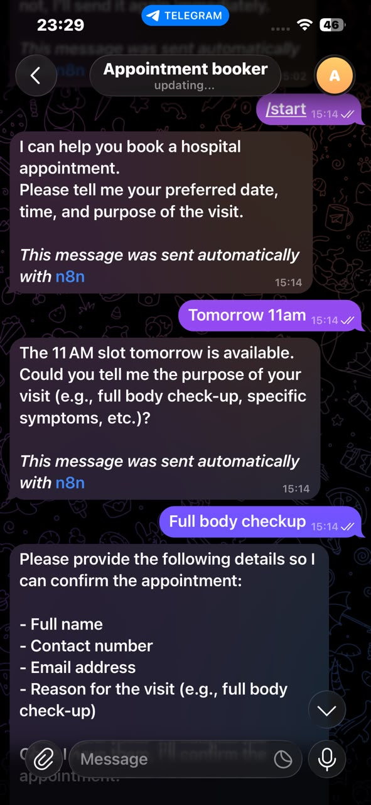
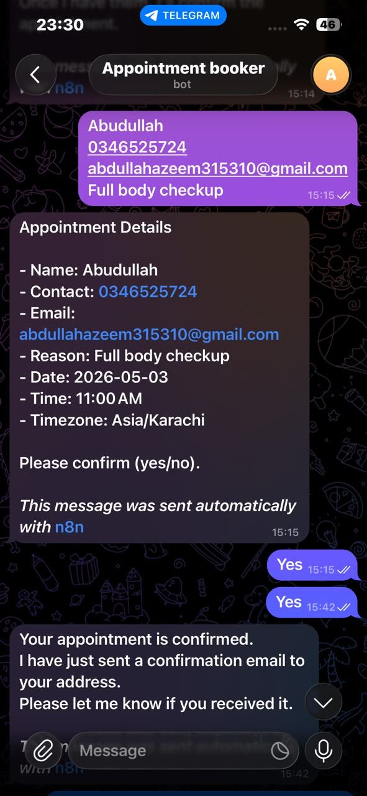
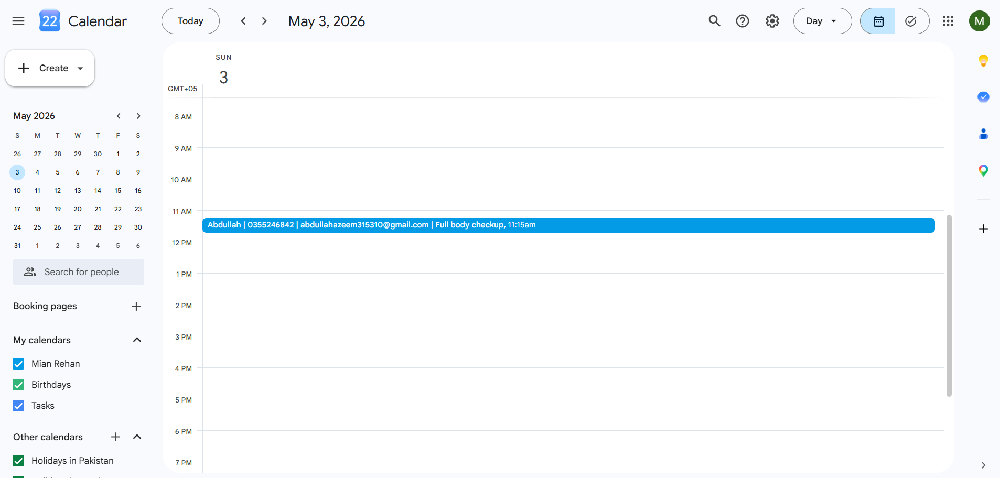
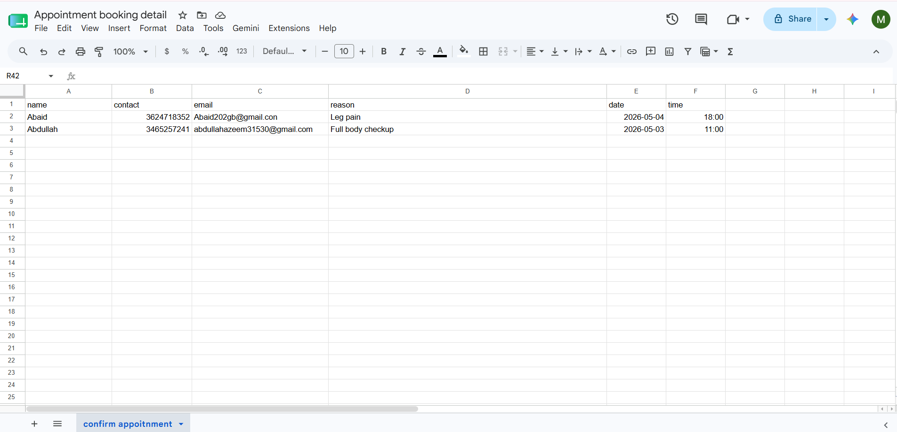

# 🤖 AI Hospital Appointment Booking Bot — n8n

An intelligent, fully automated hospital appointment booking system built with 
**n8n** that handles the complete patient journey via **Telegram** — from 
checking availability to sending confirmation emails — with zero human 
involvement after setup.

---

## 🧠 Workflow Architecture

The entire system runs inside a single n8n workflow with an AI Agent at its 
core. The agent is powered by Groq LLM and has 7 tools connected to it — 
calendar checker, calendar creator, Google Sheets logger, and dual Gmail 
notifier. Every decision is made by the AI based on real-time calendar data.

---

## 🔄 How It Works — Step by Step

1. Patient sends any message to the Telegram bot
2. AI Agent greets and asks for preferred date, time and purpose of visit
3. Bot checks Google Calendar in real time for slot availability
4. If slot is available — AI collects patient details step by step:
   - Full name
   - Contact number
   - Email address
   - Reason for visit
5. AI shows complete summary and asks for confirmation (yes/no)
6. **If patient confirms:**
   - Creates event in Google Calendar with full patient details
   - Saves record to Google Sheets with all fields
   - Sends confirmation email to patient via Gmail
   - Sends notification email to doctor via Gmail
7. **If slot is unavailable:**
   - Informs patient politely
   - Suggests alternative times
8. Bot blocks past-time bookings automatically

---

## 🖼️ Screenshots

### Telegram — Booking Flow (Part 1)

### Telegram — Booking Flow (Part 2)

### Google Calendar — Appointment Created

### Google Sheets — Patient Records Log

### Gmail — Confirmation Email to Patient

### Gmail — Notification Email to Doctor

---

## 🛠️ Tech Stack

| Tool | Purpose |
|------|---------|
| n8n | Core workflow automation engine |
| Groq LLM | AI brain — handles conversation and decisions |
| Telegram Bot API | Patient-facing chat interface |
| Google Calendar API | Availability check + appointment creation |
| Google Sheets API | Patient records database |
| Gmail API | Dual email notifications (patient + doctor) |
| Prompt Engineering | Conversation flow and response design |

---

## ✨ Key Features

- ✅ Real-time Google Calendar availability check before booking
- ✅ Blocks past-time bookings automatically
- ✅ Multi-step conversational flow — natural chat experience
- ✅ Collects all 4 required fields before confirming
- ✅ Creates calendar event with complete patient info
- ✅ Saves every booking to Google Sheets automatically
- ✅ Dual email system — patient gets confirmation, doctor gets notification
- ✅ Per-user conversation memory (last 50 messages)
- ✅ Asia/Karachi timezone support

---

## 🤖 AI Agent Tools

The AI Agent has 7 tools it can call at any time:

| Tool | Type | What It Does |
|------|------|-------------|
| Date & Time | DateTime | Gets current time in Asia/Karachi timezone |
| search | Google Calendar (read) | Checks existing events to prevent double booking |
| creat | Google Calendar (write) | Creates confirmed appointment event |
| Sheet | Google Sheets | Saves patient record with all details |
| Gmail — Patient | Gmail Tool | Sends confirmation email to patient |
| Gmail — Doctor | Gmail Tool | Sends notification email to doctor |
| Telegram Reply | Telegram | Sends response back to patient |

---

## 🗂️ Google Sheets Structure

**Columns saved for every booking:**

| Name | Contact | Email | Reason | Date | Time |
|------|---------|-------|--------|------|------|
| Abdullah | 0346525724 | email@gmail.com | Full body checkup | 2026-05-03 | 11:00 |

---

---

## 📦 Setup Instructions

1. Import `workflow.json` into your n8n instance
2. Connect the following credentials:
   - Telegram Bot token (create via BotFather)
   - Google Calendar OAuth2
   - Google Sheets OAuth2
   - Gmail OAuth2
   - Groq API key (free at console.groq.com)
3. Update your Google Sheet ID in the Sheet node
4. Update doctor email address in the Gmail doctor node
5. Set timezone to Asia/Karachi in DateTime node
6. Activate the workflow
7. Open Telegram, find your bot and send any message

---

## 🎯 Purpose

This project was built to demonstrate real-world automation skills including:
- AI Agent design with multiple tool integrations
- Real-time API data fetching and decision making
- Multi-API workflow engineering
- Prompt engineering for natural conversation design
- End-to-end business process automation

---

## 👤 Author

**Mian Rehan** — AI Automation Developer
[LinkedIn](https://www.linkedin.com/in/muhammad-rehan/) | 
[GitHub](https://github.com/mianrehan05911-alt)
